# Audio Processing Service - Program Flow Diagram

This diagram illustrates the internal workflow of the Audio Processing Service, from the initial file upload to the generation of pronunciation feedback.

```mermaid
graph TD
    %% Entry Points
    Start["User/Client"] -->|"POST /process-audio"| Upload["Upload Endpoint"]
    Start -->|"GET /get-audio-results/{request_id}"| Results["Results Endpoint"]

    subgraph "Request Handling (Upload)"
        Upload --> Validate["Validate File Type .wav, .mp3, .webm"]
        Validate -->|"Valid"| GenUUID["Generate Request ID & Directory"]
        GenUUID --> SaveRaw["Save Uploaded File as test.wav"]
    end

    subgraph "Module 1: Audio Processing"
        SaveRaw --> AudioProc["audio_processor.py: process_audio"]
        AudioProc --> Load["1. Load Audio 16kHz, Mono"]
        Load --> Noise["2. Noise Reduction"]
        Noise --> Trim["3. Trim Silence"]
        Trim --> Norm["4. Normalization"]
        Norm --> SaveProc["5. Save as test_processed.wav"]
        SaveProc --> CleanUp1["6. Delete Original Upload"]
    end

    subgraph "Module 2: Transcription"
        CleanUp1 --> TransService["transcription_service.py: transcribe_and_create_lab"]
        TransService --> Whisper["1. Whisper Transcription German"]
        Whisper --> Digits["2. Convert Digits to Words"]
        Digits --> CleanText["3. Remove Punctuation & Lowercase"]
        CleanText --> SaveLab["4. Save as test_processed.lab"]
    end

    subgraph "Module 3: MFA Alignment & GOP"
        SaveLab --> MFA_Service["test_alignment.py: runMFAall"]
        MFA_Service --> MFA_Cmd["1. Run MFA Align german_mfa"]
        MFA_Cmd --> ExtPhonemes["2. Extract Phoneme Intervals from TextGrid"]
        ExtPhonemes --> Wav2Vec["3. Run Wav2Vec2 for GOP Scores"]
        Wav2Vec --> SaveGOP["4. Save as gop_results.json"]
    end

    subgraph "Module 4: Feedback Generation"
        SaveGOP --> FeedService["feedback_service.py: runFeedback"]
        FeedService --> Adapt["1. Adaptive Thresholds - User Feedback"]
        Adapt --> IntelAnal["2. Intelligent Analysis Difficulties/Trends"]
        IntelAnal --> FeedGen["3. Generate User-Friendly Feedback"]
        FeedGen --> SaveFinal["4. Save feedback.json, feedback.txt, heatmap.json"]
    end

    %% Final Return
    SaveFinal --> ReturnID["Return Request ID to Client"]

    subgraph "Result Retrieval"
        Results --> CheckExists{"Request Directory Exists?"}
        CheckExists -->|"Yes"| LoadJSON["Load feedback.json"]
        CheckExists -->|"No"| Err404["Return 404 Not Found"]
        LoadJSON --> ReturnJSON["Return Feedback Data"]
    end

    %% Styling
    style Start fill:#f9f,stroke:#333,stroke-width:2px
    style ReturnID fill:#bbf,stroke:#333,stroke-width:2px
    style ReturnJSON fill:#bbf,stroke:#333,stroke-width:2px
    style AudioProc fill:#dfd,stroke:#333
    style TransService fill:#dfd,stroke:#333
    style MFA_Service fill:#dfd,stroke:#333
    style FeedService fill:#dfd,stroke:#333
```

## Module Descriptions

### [main.py](file:///c:/Users/dadim/Documents/klarText-Backend/audioProcessingService/main.py)
The core FastAPI application that orchestrates the entire pipeline. It handles file uploads, directory management, and calls the specialized modules in sequence.

### [audio_processor.py](file:///c:/Users/dadim/Documents/klarText-Backend/audioProcessingService/audio_processor.py)
Responsible for preparing the audio for analysis. It ensures consistent sample rates (16kHz), reduces background noise, and normalizes volume levels.

### [transcription_service.py](file:///c:/Users/dadim/Documents/klarText-Backend/audioProcessingService/transcription/transcription_service.py)
Uses OpenAI's Whisper model to convert speech to text. It also performs post-processing to convert digits to words and strip punctuation, which is required for accurate alignment.

### [test_alignment.py](file:///c:/Users/dadim/Documents/klarText-Backend/audioProcessingService/mfa/test_alignment.py)
Integrates the Montreal Forced Aligner (MFA) to map the transcription to specific time intervals in the audio. It then uses a Wav2Vec2 model to calculate "Goodness of Pronunciation" (GOP) scores for each phoneme.

### [feedback_service.py](file:///c:/Users/dadim/Documents/klarText-Backend/audioProcessingService/feedback/feedback_service.py)
The final stage that translates technical GOP scores into pedagogical feedback. it uses adaptive thresholds based on user history and identifies specific pronunciation patterns that need improvement.
